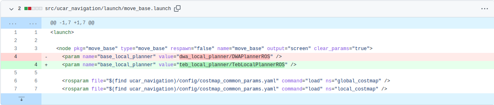
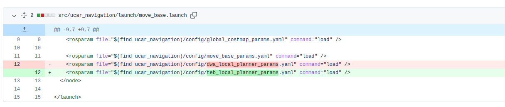

# 更换路径规划器

本示例中内建的局部路径规划器是dwa. 感觉不够好, 对吧?  
这里以[teb_local_planner](http://wiki.ros.org/teb_local_planner)为示例, 进行规划器的更换.  
  
## 获取teb_local_planner

请从下面两种安装方法中, 按照需求, 选择一个

1. 从二进制安装

    ```sh
    sudo apt install ros-noetic-teb-local-planner
    ```

    > 如果你使用的是ROS melodic, 记得替换包名称中的noetic为melodic

    通过包管理器安装方便快捷

2. 从源代码安装

    进入工作空间的`src`目录下, 执行

    ```sh
    # 克隆代码
    git clone https://github.com/rst-tu-dortmund/teb_local_planner.git
    # 更改分支
    cd teb_local_planner
    git checkout noetic-devel #同样, 根据自己ROS版本
    # 编译
    cd ../../
    catkin_make
    ```

    > 你也可以将其放在其他工作空间中, 然后通过[workspace overlay](http://wiki.ros.org/catkin/Tutorials/workspace_overlaying)让当前的工作空间能够使用它的包

    通过源代码安装可以进行打印日志, 挂接调试器, 修改代码等

## 修改launch文件

观察launch文件的结构, 我们通过`ucar_bringup`的`nav_start.launch`启动了工程, 其中, 启动了`ucar_navigation`中的`nav.launch`, 进而启动了'move_base.launch'  
在`move_base.launch`中, 指定了局部路径规划器. 将其从dwa改成teb



> 同理, 通过指定参数`base_global_planner`, 全局路径规划器也可以更换哦,  
> 常用的实现有global_planner/GlobalPlanner, carrot_planner/CarrotPlanner,astar_planner/AstarPlanner等
  
> 如果不想在launch文件中指定, 也可以在move_base的配置文件中指定规划器

至此, 局部路径规划器已经更换为teb

## 为teb加载参数

为了方便, 一般会将参数写在一个yaml文件中, 在节点启动时进行加载.  
在`move_base.launch`中, 有对dwa加载参数文件的语句. 同理可以修改成teb的



记得把提供的示例teb配置文件放到`src/ucar_navigation/config`下

>`teb_local_planner_params.yaml`这个文件, 因为是加载在move_base下的, 这个参数文件中参数的名称空间是movebase, 所以所有参数都要写在`TebLocalPlannerROS:`下, 并进行缩进.
>这样使他们具有movebase/TebLocalPlannerROS的名称空间, 才能被teb加载

## 调节teb的参数

在给出的实例参数文件`teb_local_planner_params.yaml` 中, 给出了主要的一部分参数, 和它们的释义.

[ROS wiki/teb_local_planner](http://wiki.ros.org/teb_local_planner)中给出来全部参数及其意义, 以及对一些固定值设置的指导.  
  
在调节规划器参数前, 建议先把代价地图, 定位与控制更新频率等调整好  
  
推荐使用[rqt_reconfigure](http://wiki.ros.org/rqt_reconfigure), 能够在运行时改变参数观察效果, 调完记得保存.  
reconfigure还有python和c++的api, 可以自己编写一个节点, 在小车运行过程中变化参数  
  
推荐使用git版本管理来存储多个版本的参数, 必要时可以进行回滚等操作
  
空地图跑得快不一定好, 在gazebo中自行添加障碍物来测试避障能力  

## 其他的teb实现

本次使用[rst-tu-dortmund/teb_local_planner](https://github.com/rst-tu-dortmund/teb_local_planner)这是一个主流的, ROS中使用的Timed Elastic Band导航算法的实现.  
这是一个movebase导航框架的插件 (就像示例中提供的dwa一样), 比较方便进行更换.

[RoboMaster/RoboRTS](https://github.com/RoboMaster/RoboRTS)中提供了一个作为独立节点的teb实现
需要自己独立启动导航框架的组件, 连接话题等, 使用起来相对复杂  
但性能要求比movebase的teb实现低  
  
如果你的更新频率与控制频率总是达不到设定值的话, 换用RoboMaster/RoboRTS也许会有更好的结果
